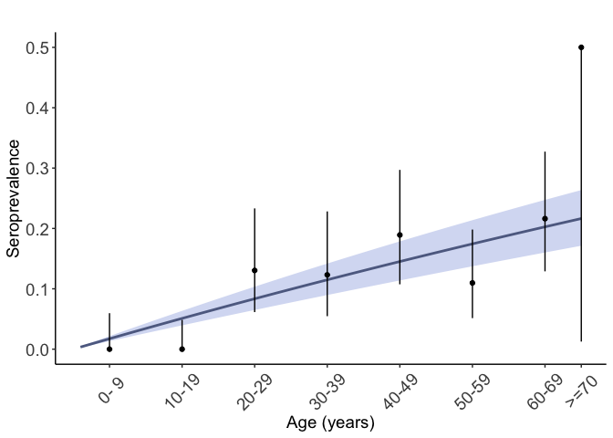
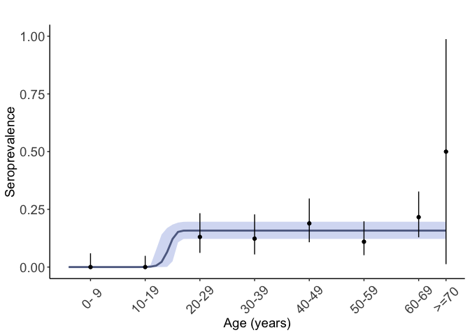

<!-- README.md is generated from README.Rmd. Please edit that file -->
Rsero: Estimate the annual force of infection using serological data
====================================================================

Rsero is R package dedicated to the implementation of serocatalytic models that are used to estimate the force of infection from age-stratified serological surveys.

Estimations requires:
- The age of each individual

-   Their seropositivity status

-   The year of sampling

-   A model of pathogen circulation

The package provides a standardized framework to store serological data, analyze serological surveys, use a variety of serocatalytic models, run MCMC algorithm to estimate the parameters of the force of infection, and analyse the results.

Installation
------------

To install the package, type

``` r
devtools::install_github("nathoze/Rsero")
```

(This step requires that the package *devtools* is installed). Installation may take a few minutes due to the compilation of the stan files that encode the serocatalytic models.

MCMC simulations are done using the package rstan, that requires Rtools 3.3 on Windows computers. Rtools 3.3 can be found here <https://cran.r-project.org/bin/windows/Rtools/>

More details
------------

More details on the available serocatalytic models can be found in the vignette *models*. This vignette includes several examples and shows the different features of the packages

Worked example.
---------------

In this example we show the basic steps to follow to get a complete analysis of a serological survey. This analysis uses a simulated dataset containing samples of 500 individuals.

``` r
library(Rsero)
#> Loading required package: Rcpp
#> Warning: package 'Rcpp' was built under R version 3.3.3
#> Loading required package: corrplot
#> Warning: package 'corrplot' was built under R version 3.3.3
#> corrplot 0.84 loaded
#> Loading required package: ggplot2
#> Warning: package 'ggplot2' was built under R version 3.3.3
#> Loading required package: binom
#> Warning: package 'binom' was built under R version 3.3.3
data('one_peak_simulation')
```

The data is saved under a custom format *SeroData*, that stores information about the serological surveys and details on the participants. Basic information such as the seroprevalence can be obtained simply by typing

``` r
seroprevalence(one_peak_simulation)
#> [1] "Mean: 0.11    2.5%: 0.09    97.5%: 0.15"
#> [1] "Mean: 0.11    2.5%: 0.09    97.5%: 0.15"
```

and a graph of the age profile of seroprevalence is obtained using

``` r
seroprevalence.plot(one_peak_simulation)
#> [[1]]
```


Age-stratified serological surveys assess immunological markers of past infections and can be used to reconstruct the historical patterns of the circulation of an infectious disease and the force of infection (the per capita rate at which susceptible individuals will be infected a given year). Such inference is performed using serocatalytic models. The Rsero package proposes several models that can be fitted to the data using the command

``` r
FOIfit = fit( data = one_peak_simulation,  model = seromodel)
```

In its basic form a model is defined by specifying the mode of circulation of the pathogen. The simplest type of model assumes a constant force of infection. We define it with the command

``` r
ConstantModel = FOImodel(type = 'constant')
```

We can now fit the defined model to the data:

``` r
FOIfit.constant = fit( data = one_peak_simulation,  model = ConstantModel, chains=1)
#> 
#> SAMPLING FOR MODEL 'intervention' NOW (CHAIN 1).
#> Rejecting initial value:
#>   Log probability evaluates to log(0), i.e. negative infinity.
#>   Stan can't start sampling from this initial value.
#> Rejecting initial value:
#>   Log probability evaluates to log(0), i.e. negative infinity.
#>   Stan can't start sampling from this initial value.
#> Rejecting initial value:
#>   Log probability evaluates to log(0), i.e. negative infinity.
#>   Stan can't start sampling from this initial value.
#> Rejecting initial value:
#>   Log probability evaluates to log(0), i.e. negative infinity.
#>   Stan can't start sampling from this initial value.
#> Rejecting initial value:
#>   Log probability evaluates to log(0), i.e. negative infinity.
#>   Stan can't start sampling from this initial value.
#> Rejecting initial value:
#>   Log probability evaluates to log(0), i.e. negative infinity.
#>   Stan can't start sampling from this initial value.
#> Rejecting initial value:
#>   Log probability evaluates to log(0), i.e. negative infinity.
#>   Stan can't start sampling from this initial value.
#> Rejecting initial value:
#>   Log probability evaluates to log(0), i.e. negative infinity.
#>   Stan can't start sampling from this initial value.
#> Rejecting initial value:
#>   Log probability evaluates to log(0), i.e. negative infinity.
#>   Stan can't start sampling from this initial value.
#> Rejecting initial value:
#>   Log probability evaluates to log(0), i.e. negative infinity.
#>   Stan can't start sampling from this initial value.
#> 
#> Gradient evaluation took 0 seconds
#> 1000 transitions using 10 leapfrog steps per transition would take 0 seconds.
#> Adjust your expectations accordingly!
#> 
#> 
#> Iteration:    1 / 5000 [  0%]  (Warmup)
#> Iteration:  500 / 5000 [ 10%]  (Warmup)
#> Iteration: 1000 / 5000 [ 20%]  (Warmup)
#> Iteration: 1500 / 5000 [ 30%]  (Warmup)
#> Iteration: 2000 / 5000 [ 40%]  (Warmup)
#> Iteration: 2500 / 5000 [ 50%]  (Warmup)
#> Iteration: 2501 / 5000 [ 50%]  (Sampling)
#> Iteration: 3000 / 5000 [ 60%]  (Sampling)
#> Iteration: 3500 / 5000 [ 70%]  (Sampling)
#> Iteration: 4000 / 5000 [ 80%]  (Sampling)
#> Iteration: 4500 / 5000 [ 90%]  (Sampling)
#> Iteration: 5000 / 5000 [100%]  (Sampling)
#> 
#>  Elapsed Time: 4.244 seconds (Warm-up)
#>                3.16 seconds (Sampling)
#>                7.404 seconds (Total)
#> Warning: There were 1709 divergent transitions after warmup. Increasing adapt_delta above 0.8 may help. See
#> http://mc-stan.org/misc/warnings.html#divergent-transitions-after-warmup
#> Warning: Examine the pairs() plot to diagnose sampling problems
```

(we simulate only one MCMC chain here). We now visualize the result of the fit

``` r
seroprevalence.fit(FOIfit.constant, YLIM=0.5)
#> [[1]]
```



Here the solid line is the mean annual FOI obtained from the MCMC simulations and the envelope is the 95% credible interval. This seems not a very good fit. Indeed younger individuals are all seronegative, which suggests that the pathogen did not circulate in the recent years. Several other models could explain the data. For instance we define a model of one outbreak.

``` r
OutbreakModel = FOImodel( type='outbreak', K=1)
```

We can now fit the defined model to the data:

``` r
FOIfit.outbreak = fit( data = one_peak_simulation,  model = OutbreakModel, chains=1)
#> 
#> SAMPLING FOR MODEL 'outbreak' NOW (CHAIN 1).
#> Rejecting initial value:
#>   Log probability evaluates to log(0), i.e. negative infinity.
#>   Stan can't start sampling from this initial value.
#> 
#> Gradient evaluation took 0 seconds
#> 1000 transitions using 10 leapfrog steps per transition would take 0 seconds.
#> Adjust your expectations accordingly!
#> 
#> 
#> Iteration:    1 / 5000 [  0%]  (Warmup)
#> Iteration:  500 / 5000 [ 10%]  (Warmup)
#> Iteration: 1000 / 5000 [ 20%]  (Warmup)
#> Iteration: 1500 / 5000 [ 30%]  (Warmup)
#> Iteration: 2000 / 5000 [ 40%]  (Warmup)
#> Iteration: 2500 / 5000 [ 50%]  (Warmup)
#> Iteration: 2501 / 5000 [ 50%]  (Sampling)
#> Iteration: 3000 / 5000 [ 60%]  (Sampling)
#> Iteration: 3500 / 5000 [ 70%]  (Sampling)
#> Iteration: 4000 / 5000 [ 80%]  (Sampling)
#> Iteration: 4500 / 5000 [ 90%]  (Sampling)
#> Iteration: 5000 / 5000 [100%]  (Sampling)
#> 
#>  Elapsed Time: 3.396 seconds (Warm-up)
#>                2.762 seconds (Sampling)
#>                6.158 seconds (Total)
#> Warning: There were 702 divergent transitions after warmup. Increasing adapt_delta above 0.8 may help. See
#> http://mc-stan.org/misc/warnings.html#divergent-transitions-after-warmup
#> Warning: Examine the pairs() plot to diagnose sampling problems
```

and we plot the result

``` r
seroprevalence.fit(FOIfit.outbreak)
#> [[1]]
```



Visually, this a better fit (and it is not surprising given the way the data was generated). We can compare the results of the fit using the deviance information criterion (DIC).

``` r
DIC.constant = compute_information_criteria(FOIfit.constant)
DIC.outbreak = compute_information_criteria(FOIfit.outbreak)
```

The DIC obtained for the outbreak model is lower than that for the constant model. This indicates a better fit of the outbreak model to the data.

More information
----------------

The following schematic summarizes the different functions available with the package 

More details on the models can be found in the vignette model.
